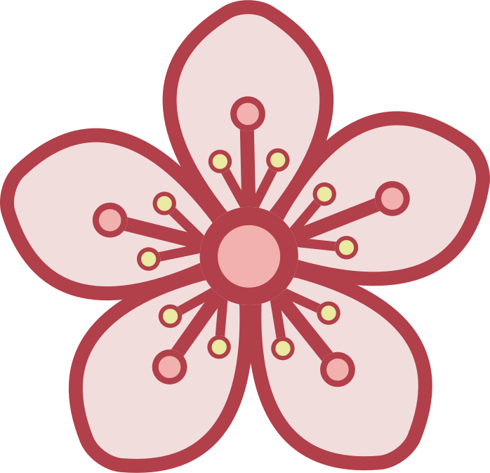

# Astro-Bloomz

[](https://github.com/wikibonsai/wikibonsai)

<p align="center">
  
  
</p>

An [Astro template](https://github.com/withastro/astro/tree/main/examples/blog) with [WikiBonsai](https://github.com/wikibonsai/wikibonsai) support.

You can see the live demo [here](https://astro-bloomz.netlify.app/).

🌸 Share bloomz from your [🎋 WikiBonsai](https://github.com/wikibonsai/wikibonsai) digital garden.

## Getting Started

### 1. Clone this Repository

```
git clone https://github.com/wikibonsai/astro-bloomz.git my-blog-name
```

### 2. Navigate to the directory

```
cd my-blog-name
```

### 3. Install dependencies

```
npm install
```

### 4. Run

```
npm run dev
```

## 🪴 Project Structure

Inside of your Astro-Bloomz project, you'll see the following folders and files:

```text
├── public/
├── src/
│   ├── components/
│   ├── content/
│   ├── layouts/
│   └── pages/
├── astro.config.mjs
├── README.md
├── package.json
└── tsconfig.json
```

Astro looks for `.astro` or `.md` files in the `src/pages/` directory. Each page is exposed as a route based on its file name.

There's nothing special about `src/components/`, but that's where we like to put any Astro/React/Vue/Svelte/Preact components.

The `src/content/` directory contains "collections" of related Markdown and MDX documents. Use `getCollection()` to retrieve posts from `src/content/blog/`, and type-check your frontmatter using an optional schema. See [Astro's Content Collections docs](https://docs.astro.build/en/guides/content-collections/) to learn more.

Any static assets, like images, can be placed in the `public/` directory.

## 🧚 Commands

All commands are run from the root of the project, from a terminal:

| Command                   | Action                                           |
| :------------------------ | :----------------------------------------------- |
| `npm install`             | Installs dependencies                            |
| `npm run dev`             | Starts local dev server at `localhost:4321`      |
| `npm run build`           | Build your production site to `./dist/`          |
| `npm run preview`         | Preview your build locally, before deploying     |
| `npm run astro ...`       | Run CLI commands like `astro add`, `astro check` |
| `npm run astro -- --help` | Get help using the Astro CLI                     |

## 👀 Want to learn more?

Check out the [Astro documentation](https://docs.astro.build) or [WikiBonsai documentation](https://github.com/wikibonsai/wikibonsai/).
